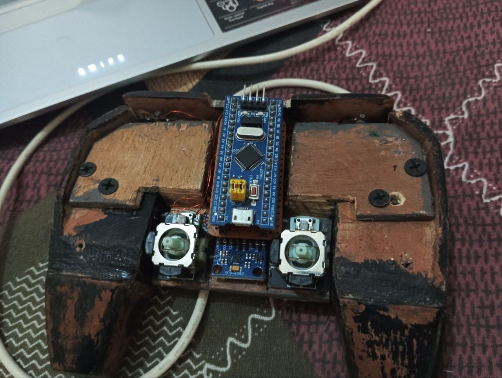
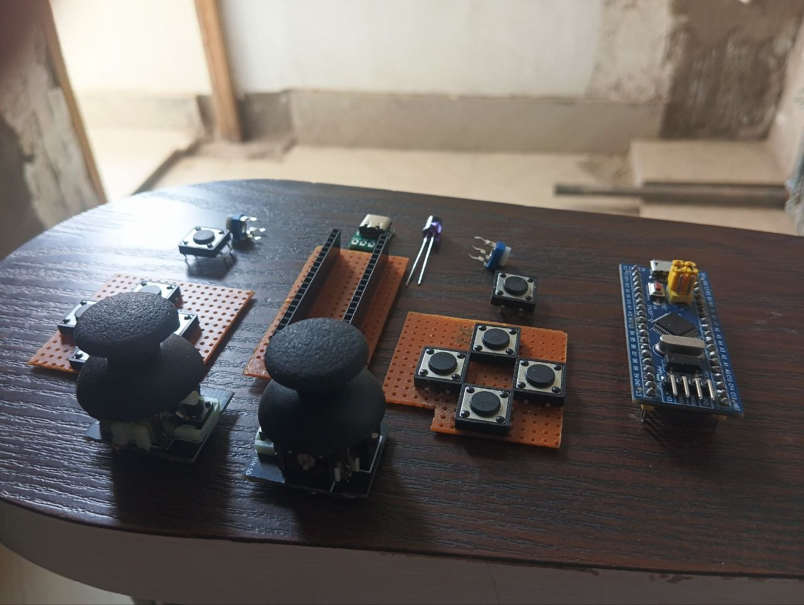

# DIY Rough Gamepad


> A handmade USB HID gamepad and reusable test pad built from scratch using STM32F103C8T6 "Blue Pill", PS2 joystick modules, and 12 tactile buttons. Tested and working in real games.

---

## Why I Built This

I needed a reusable gamepad and test pad for my STM32 projects — something I can use for flight sims, FPS games, and future experiments without rewiring buttons, joysticks, and pots on a breadboard every time. It started as a hobby project and turned into a fully functional controller that I use daily.

It looks rough — but not from heavy use. The finish is rough because this was built with whatever was available: leftover scrap wood from furniture (that would have gone into a bonfire), leftover paint from the workshop, and large furniture tools instead of precision crafting tools. No 3D printer, no professional woodworking tools, no fresh wood. Everything was improvised with what was at hand.

The electronics and firmware are the real focus here. The cosmetic finish is secondary — that's what v2 is for. Tested in:

- **Sniper Ghost Warrior 3** (FPS)
- **War Thunder** (flight sim)
- **FlightGear** (flight sim)
- **gamepad-tester.com** (browser HID test)
- **vJoy** (virtual joystick driver)

---

## Hardware

### Components

| Component | Qty | Description |
|-----------|-----|-------------|
| STM32F103C8T6 "Blue Pill" | 1 | Main MCU, 72MHz, 64KB Flash, 20KB RAM |
| PS2 Joystick Module (KY-023) | 2 | Cheap/basic analog dual-axis potentiometers (thumbsticks) |
| 10kΩ Trim Potentiometer | 2 | Mini pots used as analog shoulder triggers |
| Tactile Push Buttons (6mm) | 12 | Momentary switches for digital inputs |
| USB Connector | 1 | Micro-USB or USB-C (board dependent) |
| ST-Link V2 | 1 | For flashing firmware |
| Hookup Wire | - | For connections |

> **Note:** Buttons use the STM32's internal pull-ups (no external resistors needed). Cheap PS2 joystick modules and trim pots tend to drift — per-axis calibration in firmware fixes this.

### Pin Mapping

#### Analog Axes (ADC1 - 12-bit, 0-4095)

| Axis | Pin | Source | Calibration |
|------|-----|--------|-------------|
| X (Left Stick X) | PA0 | PS2 Joystick | min=0, max=3095, reversed |
| Y (Left Stick Y) | PA1 | PS2 Joystick | min=0, max=2595, reversed |
| Z (Right Stick X) | PA2 | PS2 Joystick | min=0, max=4095, reversed |
| Rx (Right Stick Y) | PA3 | PS2 Joystick | min=0, max=4095, reversed |
| Ry (Left Trigger) | PA4 | 10k Trim Pot | min=0, max=4095, reversed |
| Rz (Right Trigger) | PA5 | 10k Trim Pot | min=0, max=4095, normal |

#### Digital Buttons (Active Low, Internal Pull-ups)

| Button | Pin | Bit |
|--------|-----|-----|
| BTN1 | PB0 | 0 |
| BTN2 | PB1 | 1 |
| BTN3 | PB3 | 2 |
| BTN4 | PB4 | 3 |
| BTN5 | PB5 | 4 |
| BTN6 | PB8 | 5 |
| BTN7 | PB9 | 6 |
| BTN8 | PB10 | 7 |
| BTN9 | PB11 | 8 |
| BTN10 | PB12 | 9 |
| BTN11 | PB13 | 10 |
| BTN12 | PB14 | 11 |

---

## Build Process

This was built with zero budget using whatever was available in the workshop:

| Material | Source |
|----------|--------|
| Body | Scrap wood from furniture (leftover pieces that would've gone into a bonfire) |
| Paint | Leftover paint from the workshop — not bought for this project |
| Tools | Large furniture tools — no precision crafting tools, no Dremel, no 3D printer |
| Screws | Whatever was lying around |
| Wire | Standard hookup wire |

> **No fresh wood was purchased. No professional tools were used. No 3D printer.** The enclosure was carved and assembled by hand using basic workshop tools. The finish is rough because of the tools and materials available, not because of neglect or heavy use. This is a v1 functional prototype — the focus was on getting the electronics and firmware right. v2 will have a proper enclosure.

---

## USB HID Descriptor

The gamepad uses a custom USB HID descriptor (14-byte report):

```
Report Layout (14 bytes):
[0-1]   Axis X   (16-bit, 0-4095)
[2-3]   Axis Y   (16-bit, 0-4095)
[4-5]   Axis Z   (16-bit, 0-4095)
[6-7]   Axis Rx  (16-bit, 0-4095)
[8-9]   Axis Ry  (16-bit, 0-4095)
[10-11] Axis Rz  (16-bit, 0-4095)
[12]    Buttons low byte  (bits 0-7)
[13]    Buttons high byte (bits 8-11) + 4-bit padding
```

No external libraries needed — raw USB HID class, compatible with Windows/Linux without drivers.

---

## Firmware

### Build with PlatformIO

```bash
# Clone the repo
git clone https://github.com/forgeVII-org/DIY-Rough-Gamepad.git
cd DIY-Rough-Gamepad/firmware

# Build
pio run

# Flash via ST-Link
pio run -t upload
```

### Build Requirements

- [PlatformIO CLI](https://platformio.org/install/cli) or VS Code + PlatformIO Extension
- ST-Link V2 programmer connected to the Blue Pill

### Project Structure

```
firmware/
├── platformio.ini              # PlatformIO build configuration
├── STM32F103C8TX_FLASH.ld     # Linker script
├── src/
│   ├── main.c                  # Main firmware — ADC, buttons, USB HID report
│   ├── adc.c / adc.h          # ADC1 configuration (6 channels)
│   ├── gpio.c / gpio.h        # GPIO configuration (12 button inputs)
│   ├── i2c.c / i2c.h          # I2C1 configuration (reserved for v2)
│   ├── usb_device.c            # USB device initialization
│   ├── usbd_conf.c             # USB PMA buffer allocation
│   ├── usbd_core.c             # USB core stack
│   ├── usbd_ctlreq.c           # USB control requests
│   ├── usbd_desc.c             # USB device descriptors
│   ├── usbd_hid.c              # HID class — report descriptor + endpoints
│   ├── usbd_ioreq.c            # USB I/O requests
│   ├── stm32f1xx_hal_msp.c     # HAL MSP initialization
│   ├── stm32f1xx_it.c          # Interrupt handlers
│   ├── system_stm32f1xx.c      # System clock configuration
│   ├── syscalls.c / sysmem.c   # Newlib stubs
│   └── main.h                  # Main header
└── include/
    ├── *.h                     # All header files
    └── stm32f1xx_hal_conf.h    # HAL configuration
```

---

## Videos

### Build Overview
[](https://youtu.be/Yqp5RxeJppQ)

### Gamepad Tester
[](https://youtube.com/shorts/HnyjZVwW-kU)

### Trigger Test
[](https://youtube.com/shorts/2lrAC-Qs9rI)

### Gameplay Testing
[](https://youtube.com/shorts/NsDt_gfPhqs)

## Photos





---

## How It Works

1. **ADC Reads** — 6 analog channels from PS2 joystick potentiometers read via12-bit ADC, calibrated per-axis for each physical pot's range
2. **Button Matrix** — 12 tactile buttons using STM32's internal pull-ups, active-low, no external resistors needed
3. **USB HID** — Raw USB HID gamepad class, 14-byte report sent every 10ms, appears as standard joystick on Windows/Linux
4. **No Drivers** — Uses USB HID class natively — works out of the box with vJoy, Windows Game Controllers, gamepad-tester.com, and games

---

## Known Issues

### MPU6050 Gyro/Accel — Not Working (v1)

I attempted to add an MPU6050 (GY-521) gyro/accelerometer via I2C to add 6 more axes (accel X/Y/Z + gyro X/Y/Z). Despite extensive testing, **I2C communication consistently failed on this STM32F103 board**:

- **Hardware I2C1 (PB6/PB7)** — Returned all zeros. Known silicon bug in STM32F103 I2C1 peripheral.
- **Hardware I2C2 (PB10/PB11)** — Same result, pins occupied by buttons anyway.
- **Software I2C (bit-bang)** — Returns stale data, values stuck at 1.
- **Tested with** multiple initialization sequences (400kHz, 100kHz, full reset/wake cycle), DWT-accurate microsecond delays, and both address variants (0x68/0x69).
- **Confirmed working** — Same MPU6050 module works perfectly on Arduino Nano with MPU6050_tockn library, so the hardware is fine.

**Root cause**: Likely a combination of STM32F103 I2C hardware errata and missing external pull-up resistors (4.7kΩ) on the I2C bus. This will be fixed in v2.

### Button Sensitivity

Some axes reach max value before the joystick reaches its physical stop. This is due to cheap PS2 potentiometer's rotation range not matching the joystick's mechanical travel. Per-axis calibration (min/max + optional reverse) fixes both the range mismatch and center drift common in budget joystick modules.

---

## Roadmap — Version 2

Version 2 will be a complete redesign using **ESP32-S3** with:

| Feature | Status |
|---------|--------|
| ESP32-S3 with native USB HID | Planned |
| MPU6050 gyro/accel working (I2C fix) | Planned |
| Bluetooth gamepad mode | Planned |
| Wireless 2.4GHz mode | Planned |
| LiPo battery with charging | Planned |
| Better enclosure design | Planned |
| OLED status display | Planned |
| RGB LED indicators | Planned |
| Multi-mode (gamepad / flight / custom) | Planned |
| IR remote control (TV/STB) | Planned |

---

## Troubleshooting

### Device shows as "Unknown USB Device (Device Descriptor Request Failed)"
- Re-flash firmware
- Check USB D-/D+ wiring
- Try different USB port

### Axes not responding
- Check PA0-PA5 wiring to joystick modules
- Verify 3.3V power to joystick VCC

### Buttons not responding
- STM32 internal pull-ups are enabled in firmware — no external resistors needed
- Verify buttons are wired active-low (pin to GND through button)

### Device shows Code 10 in Device Manager
- Re-flash firmware
- Uninstall device in Device Manager and replug
- Check USB descriptor matches (14-byte report)

---

## License

This project is licensed under the MIT License — see [LICENSE](LICENSE) for details.

---

## Acknowledgments

- STMicroelectronics for the STM32 HAL and USB device library
- PlatformIO for the build system
- The STM32 community for USB HID implementation guides
- My AI assistant for debugging and code generation

---

**Built as a hobby project. It's rough, it's used, and I'm proud of it.** 
